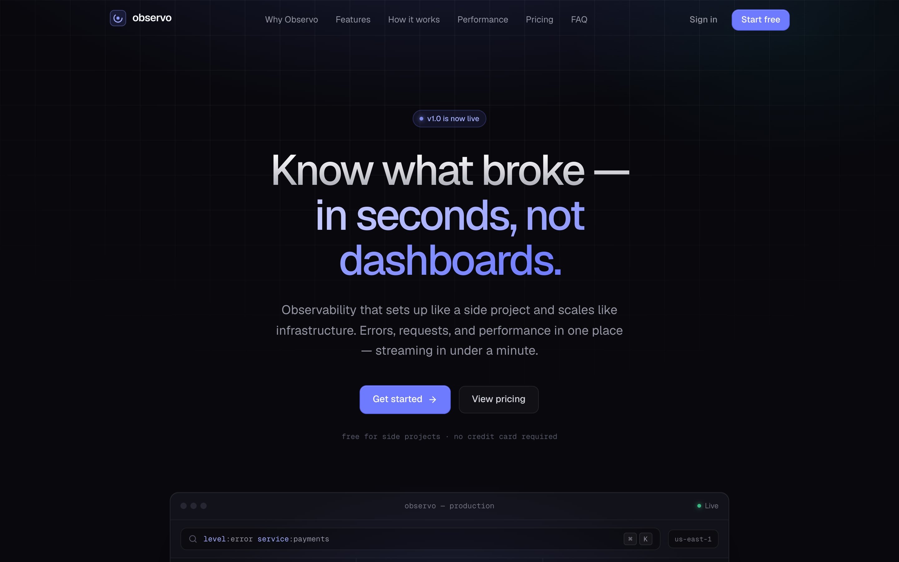
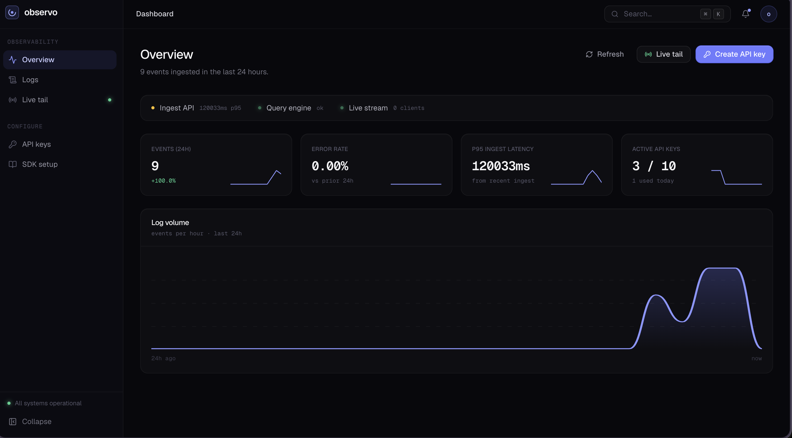
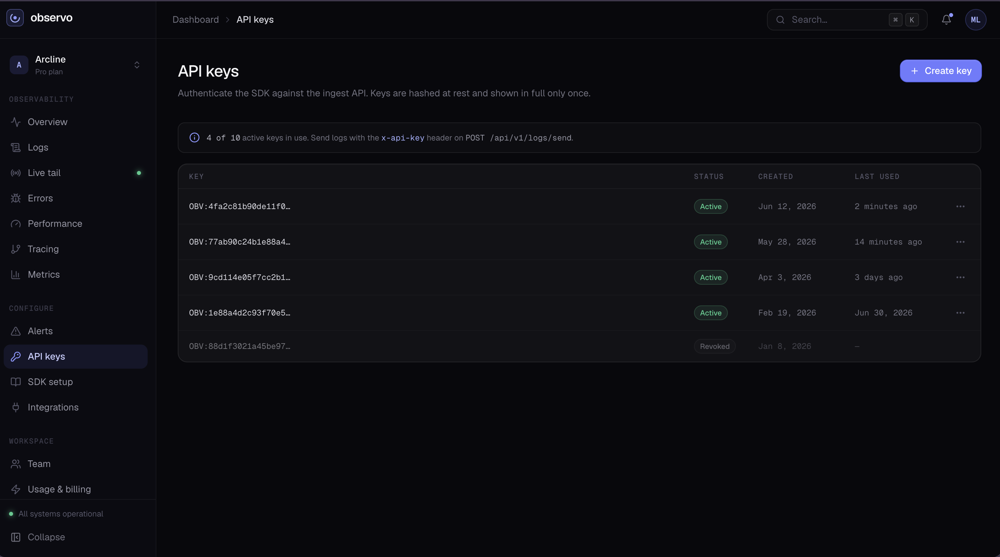

# Observo

<p align="center">
  <strong>Developer-first logging &amp; observability</strong><br/>
  Drop in an API key, stream logs to ClickHouse, search and live-tail in under a minute.
</p>

<p align="center">
  
  
  
  
  
  
  
  
</p>

<p align="center">
  
</p>

**Observo** is a full-stack logging platform: marketing site, auth, dashboard, ingest API, async pipeline, and analytics — built as a real product shape, not a thin demo.

---

## Engineering highlights

| Area                     | Implementation                                                                                             |
| ------------------------ | ---------------------------------------------------------------------------------------------------------- |
| **Distributed ingest**   | HTTPS batch intake → NATS JetStream → durable consumer → ClickHouse MergeTree                              |
| **Realtime UX**          | SSE live tail with reconnect backoff, pause buffer, and capped event window                                |
| **Auth & security**      | Better Auth sessions; Argon2-hashed API keys; one-time secret reveal; regenerate without changing key IDs  |
| **Hot-path performance** | LRU + Redis digests for SDK auth; debounced `lastUsedAt` writes; ClickHouse hourly overview aggregations   |
| **Product frontend**     | TanStack Start/Router/Query dashboard, `@observo/ui` design system, marketing + polished key management UX |
| **Platform**             | pnpm + Turborepo monorepo, Docker Compose (Redis / ClickHouse / NATS), Drizzle migrations                  |

---

## What it does

With Observo you can:

1. Create an API key in the dashboard
2. Send logs with `x-api-key`
3. Search ClickHouse-backed history and watch a **live tail**
4. See workspace health on an **overview** (24h volume, error rate, ingest p95, active keys)

| Area          | What’s live                                                      |
| ------------- | ---------------------------------------------------------------- |
| **Ingest**    | `POST /api/v1/logs/send` · API-key auth · Redis-backed key cache |
| **Pipeline**  | NATS JetStream → ClickHouse (30-day TTL, monthly partitions)     |
| **Query**     | Filters: time range, level, app, env, message search             |
| **Live tail** | SSE stream, pause/resume, exponential reconnect                  |
| **Overview**  | Metrics, hourly volume chart, derived system status              |
| **API keys**  | Create · regenerate · revoke · one-time plaintext reveal         |
| **Auth**      | Email/password via Better Auth                                   |
| **Marketing** | Landing, pricing, FAQ, sign-in / sign-up                         |

---

## Screenshots

<p align="center">
  <br/>
  <em>Marketing landing — product story and CTA</em>
</p>

<p align="center">
  <br/>
  <em>Dashboard chrome — command palette, nav, session</em>
</p>

<p align="center">
  <br/>
  <em>API keys — hashed at rest, shown once on create/regenerate</em>
</p>

---

## Architecture

```text
  App / client
      │  x-api-key
      ▼
  NestJS API  ──POST /api/v1/logs/send──►  NATS JetStream (Observo_Logs)
                                                  │
                                                  ▼
                                           ClickHouse events
                                                  │
                    ┌─────────────────────────────┼─────────────────────────────┐
                    ▼                             ▼                             ▼
             GET /logs (query)          GET /logs/stream (SSE)          GET /overview
                    │                             │                             │
                    └─────────────── Dashboard (TanStack Start) ───────────────┘

  Postgres + Drizzle  →  users / sessions (Better Auth) + api_keys
  Redis               →  API-key cache, last-used, ingest latency samples
```

**Data path**

1. Client sends a batch of logs with `x-api-key`.
2. API validates the key (LRU → Redis → Postgres + Argon2), publishes to NATS.
3. Worker writes rows to ClickHouse and broadcasts to connected SSE clients.
4. Dashboard queries ClickHouse and opens live SSE for the signed-in user.

---

## Tech stack

| Layer        | Stack                                                                                             |
| ------------ | ------------------------------------------------------------------------------------------------- |
| **Web**      | React 19 · TanStack Start / Router / Query · Vite 8 · Tailwind CSS 4 · Motion · Better Auth       |
| **API**      | NestJS 11 · Better Auth · Drizzle ORM · PostgreSQL · ClickHouse · NATS JetStream · Redis · Argon2 |
| **Monorepo** | pnpm workspaces · Turborepo · shared `@observo/ui` design system                                  |

---

## Monorepo layout

```text
observo/
├── apps/
│   ├── api/                 # @observo/api — NestJS backend
│   └── web/                 # marketing + authenticated dashboard
├── packages/
│   ├── ui/                  # @observo/ui — shared React components
│   ├── utils/               # @observo/utils
│   ├── http-client/         # @observo/http-client
│   ├── tailwind-config/     # design tokens (“Iris on Ink”)
│   ├── sdk-core/            # @getobservo/core — isomorphic ingest client
│   └── sdk-node/            # @getobservo/node — Node helper + exit flush
├── docs/screenshots/
└── pnpm-workspace.yaml
```

Client SDKs:

```bash
pnpm sdk:build
# npm i @getobservo/node  (when published)
```

---

## Table of contents (setup)

- [Getting started](#getting-started)
- [Environment variables](#environment-variables)
- [API surface](#api-surface)
- [Dashboard](#dashboard)
- [Development](#development)
- [Ingest example](#ingest-example)

---

## Getting started

### Prerequisites

- Node.js 20+
- [pnpm](https://pnpm.io) 9.x
- Docker (Redis, ClickHouse, NATS)
- A Postgres database (local or Neon)

### 1. Install

```bash
pnpm install
```

### 2. Start infrastructure

```bash
cd apps/api
docker compose up -d
```

| Service                  | Port            |
| ------------------------ | --------------- |
| Redis                    | `6379`          |
| ClickHouse HTTP / native | `8123` / `9000` |
| ClickHouse UI            | `5521`          |
| NATS / monitoring        | `4222` / `8222` |

### 3. Configure environment

Create `apps/api/.env` and `apps/web/.env` using the tables below, then:

```bash
cd apps/api
pnpm db:migrate
```

### 4. Run the apps

```bash
pnpm api:dev    # API — PORT=8081 recommended
pnpm dev        # or both apps via Turbo
```

```bash
cd apps/web && pnpm dev    # http://localhost:3000
```

| App  | URL                           |
| ---- | ----------------------------- |
| Web  | http://localhost:3000         |
| API  | http://localhost:8081/api/v1  |
| Auth | Proxied via Vite `/api` → API |

---

## Environment variables

### API (`apps/api/.env`)

| Variable                                 | Example                    | Notes                                                 |
| ---------------------------------------- | -------------------------- | ----------------------------------------------------- |
| `NODE_ENV`                               | `local`                    | `local` \| `development` \| `staging` \| `production` |
| `PORT`                                   | `8081`                     | Nest listen port                                      |
| `FRONTEND_URL`                           | `http://localhost:3000`    | Trusted origin / CORS                                 |
| `DATABASE_URL`                           | `postgresql://…`           | Users, sessions, API keys                             |
| `REDIS_HOST` / `REDIS_PORT` / `REDIS_DB` | `localhost` / `6379` / `0` |                                                       |
| `REDIS_PASSWORD`                         | `observo`                  | Matches docker-compose default                        |
| `REDIS_KEY_SECRET`                       | long random string         | HMAC digests for API-key cache                        |
| `CLICKHOUSE_URL`                         | `http://localhost:8123`    |                                                       |
| `CLICKHOUSE_USERNAME`                    | `default`                  |                                                       |
| `CLICKHOUSE_PASSWORD`                    | _(empty)_                  |                                                       |
| `CLICKHOUSE_DATABASE`                    | `observo_logs`             |                                                       |
| `NATS_URL`                               | `nats://localhost:4222`    |                                                       |

### Web (`apps/web/.env`)

| Variable              | Example                        | Notes                         |
| --------------------- | ------------------------------ | ----------------------------- |
| `VITE_API_URL`        | `/api/v1`                      | Browser base (proxied in dev) |
| `VITE_SERVER_API_URL` | `http://localhost:8081/api/v1` | Server functions / SSR        |
| `VITE_WEB_URL`        | `http://localhost:3000`        | Auth URL helper               |

---

## API surface

Base path: **`/api/v1`**

| Method       | Path                       | Auth        | Description               |
| ------------ | -------------------------- | ----------- | ------------------------- |
| `POST`       | `/logs/send`               | `x-api-key` | Ingest log batch          |
| `GET`        | `/logs`                    | Session     | Query logs                |
| `GET`        | `/logs/stream`             | Session     | SSE live tail             |
| `GET`        | `/overview`                | Session     | Dashboard metrics         |
| `GET`/`POST` | `/api-keys`                | Session     | List / create             |
| `PATCH`      | `/api-keys/:id/regenerate` | Session     | Rotate secret             |
| `DELETE`     | `/api-keys/:id`            | Session     | Revoke                    |
| `*`          | `/auth/*`                  | Better Auth | Sign-up, sign-in, session |

---

## Dashboard

| Route                 | What it shows             |
| --------------------- | ------------------------- |
| `/dashboard`          | Overview metrics & volume |
| `/dashboard/logs`     | Searchable log explorer   |
| `/dashboard/live`     | Realtime SSE live tail    |
| `/dashboard/api-keys` | Key lifecycle             |
| `/dashboard/sdk`      | Install / usage snippets  |

---

## Development

```bash
pnpm build
pnpm lint
pnpm test

cd apps/api && pnpm db:generate && pnpm db:migrate
cd apps/web && pnpm format
```

---

## Ingest example

```bash
curl -X POST http://localhost:8081/api/v1/logs/send \
  -H "content-type: application/json" \
  -H "x-api-key: OBV:<key-id>:<secret>" \
  -d '{
    "logs": [{
      "type": "info",
      "message": "hello from curl",
      "app_name": "api",
      "environment": "development"
    }]
  }'
```

Open **Live tail** or **Logs** in the dashboard to confirm delivery.
